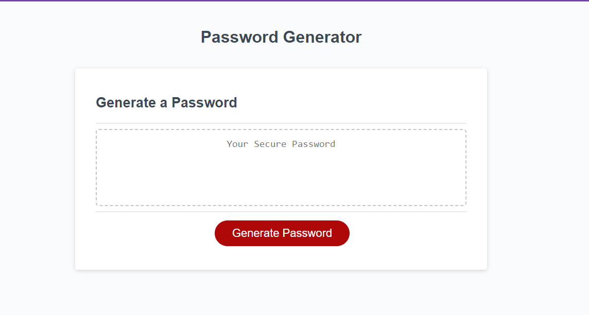

# Password Generator

## Project description 

The password generator project was brought to me with completed style and structure. My task was to create an algorithm on javascript that would take user inputs through prompt and confirm pop-ups, and, depending on the chosen criteria, the algorithm would then populate a password that would satisfy the user's selections.

Through completing this projected I gained the following:

•Practice breaking down a problem into smaller problems, and creating an algorithm that would solve the problem.

•Practice utilizing the web to research solutions to the smaller problems within the whole algorithm.

•Practice having ways to validate user input.

•Practice creating a self-explanatory naming convention, and easy to understand code without relying too much on comments.

## Installation/Usage

To see the end result, simply visit [Password-Generator](https://kev-rod43.github.io/password-generator/). 
To see the css file and html file, simply [clone](https://docs.github.com/en/repositories/creating-and-managing-repositories/cloning-a-repository "how to clone a github repository") the repository, and open the script.js file found in the root with your preferred code editing software or simple text editor.Alternatively, you can look at the code directly on github.
To utilize the app simply click on the red generate password button, and answer the pop-ups. The generator will populate a password that fits the criteria in the box under "Generate Password"

## Credits

The String.prototype.shuffle method used in my application was borrowed from an user in Stack Overflow. visit script.js file and read the comment for more information.